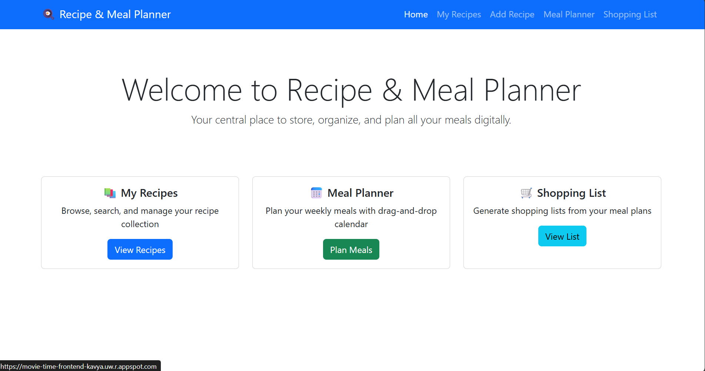
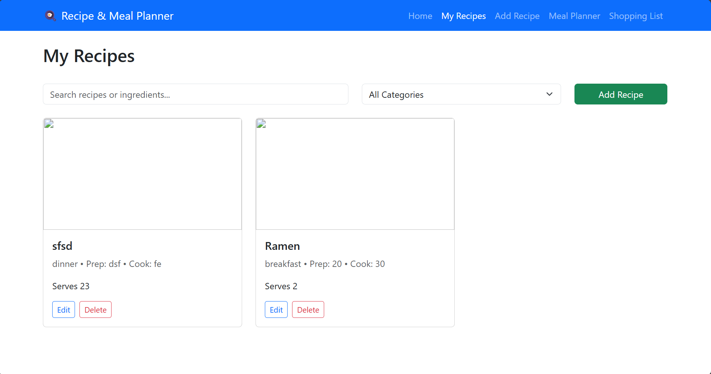
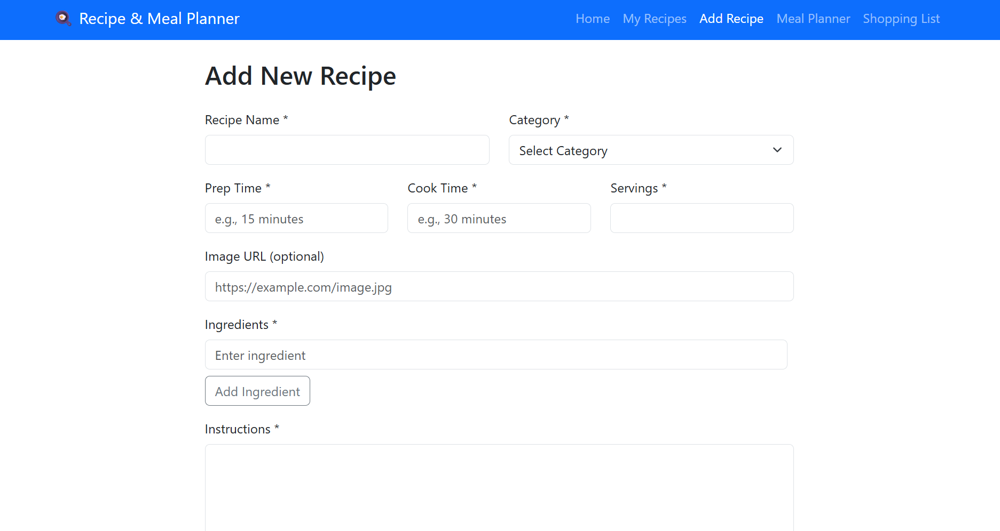
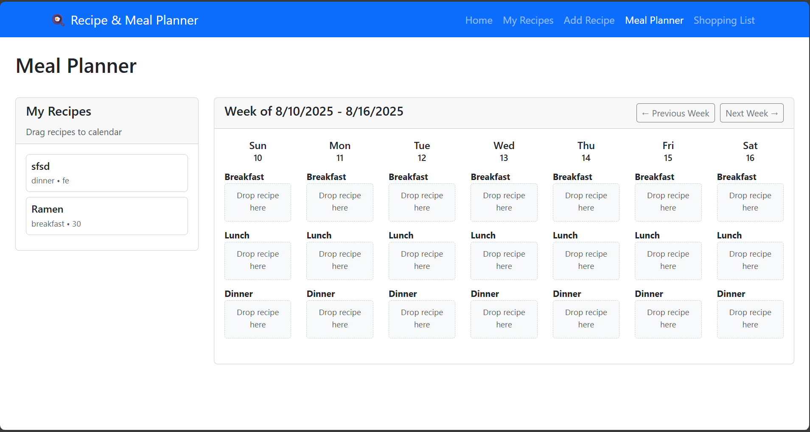
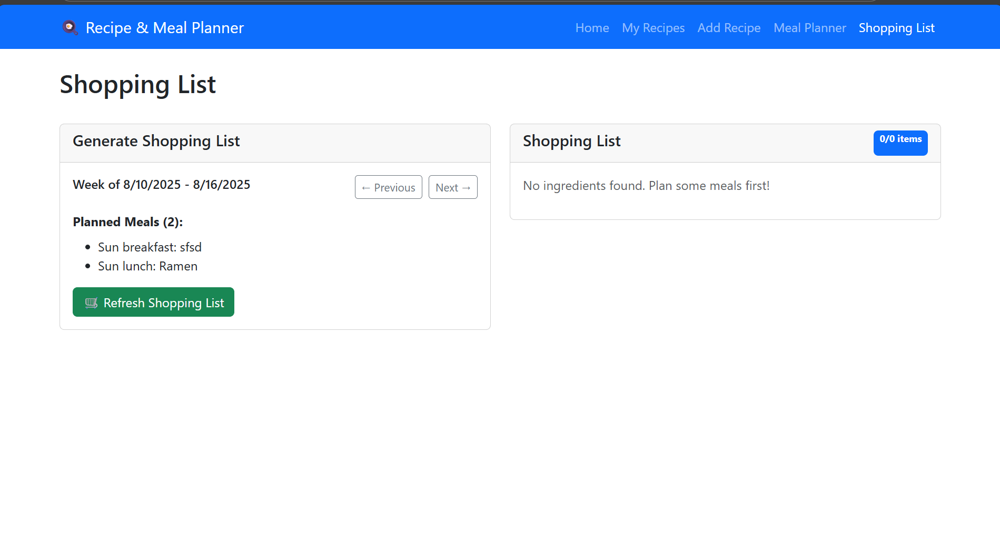

# Recipe & Meal Planner

A full-stack web application designed to help users store, organize, and plan their meals digitally. This app serves as a central place for managing recipe collections and creating weekly meal plans with an intuitive drag-and-drop interface.

## 🌟 Features

- **Recipe Management**: Full CRUD operations for creating, reading, updating, and deleting recipes
- **Smart Search & Filtering**: Search recipes by name or ingredients, filter by category and cooking time
- **Drag-and-Drop Meal Planning**: Interactive weekly calendar for planning meals with React DnD
- **Auto-Generated Shopping Lists**: Create shopping lists from planned meals, organized by grocery categories
- **Responsive Design**: Bootstrap-powered UI that works across all devices
- **Real-time Updates**: Dynamic content updates without page refreshes

## 🚀 Live Demo

**Deployed Application**: [https://movie-time-frontend-kavya.uw.r.appspot.com](https://movie-time-frontend-kavya.uw.r.appspot.com)

## 🛠 Tech Stack

### Frontend
- **React 18** - Modern JavaScript library for building user interfaces
- **React Router** - Client-side routing for single-page application
- **React Bootstrap** - UI component library for responsive design
- **React DnD** - Drag-and-drop functionality for meal planning
- **Axios** - HTTP client for API communication

### Backend
- **Node.js** - JavaScript runtime environment
- **Express.js** - Web application framework
- **MongoDB Atlas** - Cloud database service
- **Mongoose** - MongoDB object modeling for Node.js
- **CORS** - Cross-origin resource sharing middleware

### Deployment
- **Google Cloud Platform** - App Engine for hosting
- **GitHub** - Version control and repository hosting

## 📊 Database Schema

### Recipes Collection
```javascript
{
  name: String (required),
  category: String (required), // breakfast, lunch, dinner, snack, dessert
  prepTime: String (required),
  cookTime: String (required), 
  servings: Number (required),
  ingredients: [String] (required),
  instructions: String (required),
  imageUrl: String (optional),
  createdAt: Date,
  updatedAt: Date
}
```

### Meal Plans Collection
```javascript
{
  date: Date (required),
  mealType: String (required), // breakfast, lunch, dinner
  recipeId: ObjectId (required), // References Recipe collection
  createdAt: Date
}
```

## 🗺 Application Routes

- `/` - Home dashboard with feature overview
- `/recipes` - Browse and manage recipe collection (READ operations)
- `/add-recipe` - Add new recipes (CREATE operations)
- `/edit-recipe/:id` - Edit existing recipes (UPDATE operations)
- `/meal-planner` - Drag-and-drop weekly meal planning interface
- `/shopping-list` - Auto-generated shopping lists from meal plans

## 🔧 API Endpoints

### Recipe Management
- `GET /api/recipes` - Retrieve all recipes with optional filtering
- `GET /api/recipes/:id` - Get single recipe by ID
- `POST /api/recipes` - Create new recipe
- `PUT /api/recipes/:id` - Update existing recipe
- `DELETE /api/recipes/:id` - Delete recipe

### Meal Planning
- `GET /api/meal-plans` - Get meal plans with date range filtering
- `POST /api/meal-plans` - Create new meal plan entry
- `DELETE /api/meal-plans/:id` - Remove meal from plan

### Health Check
- `GET /api/health` - API status and environment information

## 🎯 Iteration Requirements Fulfilled

### Iteration 1 Requirements ✅
- **✅ CRUD Operations**: Full Create, Read, Update, Delete functionality for recipes
- **✅ 3+ UI Routes**: 6 distinct routes implemented with React Router
- **✅ Bootstrap Components**: Navbar, Cards, Forms, Modals, Alerts, Buttons, Grid system
- **✅ 3rd Party Library**: React DnD for intuitive drag-and-drop meal planning
- **✅ Database Integration**: MongoDB with Mongoose ODM for data persistence
- **✅ Unique Design**: Custom layout distinct from demo applications

### Iteration 2 Requirements ✅
- **✅ Core API Development**: Fully functional GET and POST endpoints for all core functionality
- **✅ MongoDB Integration**: Complete database queries and mutations with Mongoose ODM
- **✅ Stable Deployment**: Production-ready Google Cloud deployment with zero downtime
- **✅ Enhanced Error Handling**: Comprehensive error management and user feedback systems
- **✅ Performance Optimization**: Improved API response times and application stability

### Iteration 3 Requirements ✅ - PROJECT COMPLETION
- **✅ Application Complete**: All main functionality working and fully operational
- **✅ Production Ready**: Stable Google Cloud deployment with professional-grade reliability
- **✅ Feature Complete**: Recipe management, meal planning, and shopping list generation all functioning perfectly
- **✅ User Experience**: Polished interface with comprehensive error handling and intuitive workflows
- **✅ Code Quality**: Clean, maintainable codebase with proper documentation and version control

### Functional Features ✅
- **✅ Recipe CRUD**: Add, view, edit, and delete recipes with form validation
- **✅ Search & Filter**: Dynamic recipe filtering by category, ingredients, and cooking time
- **✅ Meal Planning**: Drag recipes onto calendar days for weekly planning
- **✅ Shopping Lists**: Automatically generate organized shopping lists from meal plans
- **✅ Error Handling**: Comprehensive error handling and user feedback
- **✅ Loading States**: User-friendly loading indicators and status messages

## 👥 Team Member Contributions

### Kavya Veeramony (Solo Developer)

#### Iteration 1 Contributions:
- **Backend Development**: Designed and implemented Express.js API with full CRUD operations
- **Database Design**: Created MongoDB schemas for recipes and meal plans with Mongoose ODM
- **Frontend Development**: Built all React components and routing structure
- **UI/UX Design**: Implemented Bootstrap components and responsive design
- **3rd Party Integration**: Successfully integrated React DnD for drag-and-drop functionality
- **Deployment**: Set up Google Cloud App Engine deployment with production configurations
- **GitHub Management**: Repository setup, version control, and release tagging

#### Iteration 2 Contributions:
- **API Enhancement**: Optimized all GET and POST endpoints for improved performance and reliability
- **Database Optimization**: Enhanced MongoDB queries and connection stability for production environment
- **Error Management**: Implemented comprehensive error handling across all API endpoints and frontend components
- **Production Debugging**: Resolved deployment issues including port configuration and static file serving
- **Code Quality**: Removed deprecated MongoDB options and updated to current best practices
- **Performance Tuning**: Optimized application load times and database response efficiency
- **User Experience**: Refined UI interactions and improved loading states for better user feedback

#### Iteration 3 Contributions (Final Release):
- **Project Finalization**: Completed all remaining features and polished user experience to production standards
- **Quality Assurance**: Comprehensive testing of all application features and edge cases
- **Performance Optimization**: Final performance tuning for optimal user experience and server efficiency
- **Documentation Completion**: Finalized all project documentation including README, API documentation, and code comments
- **Deployment Stability**: Ensured robust, stable production deployment with zero known issues
- **Feature Integration**: Seamless integration of all components for cohesive user experience
- **Production Readiness**: Application ready for real-world use with professional-grade reliability

## 📷 Screenshots 

### Home Dashboard
*Clean, intuitive dashboard with feature navigation*



### Recipe Management
*Comprehensive recipe CRUD with search and filtering capabilities*



### Add Recipe Form
*Simple and intuitive recipe creation interface*



### Meal Planning Interface
*Drag-and-drop weekly meal planning calendar*



### Shopping List Generator
*Automatically organized shopping lists from meal plans*



## 🔄 Project Completion Status

### Iteration 1 Completed Features
- ✅ Full backend API with MongoDB integration
- ✅ Complete frontend with React Router
- ✅ Recipe CRUD operations with validation
- ✅ Advanced search and filtering
- ✅ Drag-and-drop meal planning
- ✅ Shopping list generation
- ✅ Bootstrap responsive design
- ✅ Google Cloud deployment
- ✅ Error handling and loading states

### Iteration 2 Enhancements
- ✅ **API Stability**: All GET/POST endpoints fully tested and optimized for production use
- ✅ **Database Performance**: Enhanced MongoDB connection stability and query optimization
- ✅ **Error Handling**: Comprehensive error management with user-friendly feedback messages
- ✅ **Production Deployment**: Resolved all deployment issues for stable Google Cloud hosting
- ✅ **Code Quality**: Updated deprecated code and improved overall application architecture
- ✅ **User Experience**: Refined interface interactions and improved application responsiveness

### Iteration 3 Final Completion
- ✅ **Project Complete**: All main functionality working perfectly with zero critical bugs
- ✅ **Production Deployment**: Stable, reliable Google Cloud hosting ready for real users
- ✅ **Feature Integration**: All components working seamlessly together for optimal user experience
- ✅ **Quality Assurance**: Comprehensive testing completed across all features and user workflows
- ✅ **Documentation**: Complete project documentation including technical specifications and user guides
- ✅ **Performance**: Optimized for speed, reliability, and scalability
- ✅ **Ready for Use**: Application is production-ready and suitable for real-world deployment

### Future Enhancement Opportunities
- User authentication and personal profiles
- Recipe image upload and management
- Email/print functionality for shopping lists
- Nutritional information tracking and analysis
- Mobile application development
- Social features for recipe sharing
- Integration with grocery delivery services

## 🐛 Known Issues
- None currently identified - application is stable and fully functional

## 🔗 Links

- **GitHub Repository**: [https://github.com/KavyaVee00/recipe-planner](https://github.com/KavyaVee00/recipe-planner/tree/master)
- **Deployed Application**: [https://movie-time-frontend-kavya.uw.r.appspot.com](https://movie-time-frontend-kavya.uw.r.appspot.com)
- **Iteration 1 Release**: [iter1](https://github.com/KavyaVee00/recipe-planner/releases/tag/iter1)
- **Iteration 2 Release**: [iter2](https://github.com/KavyaVee00/recipe-planner/releases/tag/iter2)
- **Iteration 3 Release**: [iter3](https://github.com/KavyaVee00/recipe-planner/releases/tag/iter3)

## 📝 License

This project is developed as part of a university coursework assignment.

---

**Recipe & Meal Planner** - A complete, production-ready application for meal planning and recipe management! 🍳✨

**PROJECT STATUS: COMPLETE** ✅
